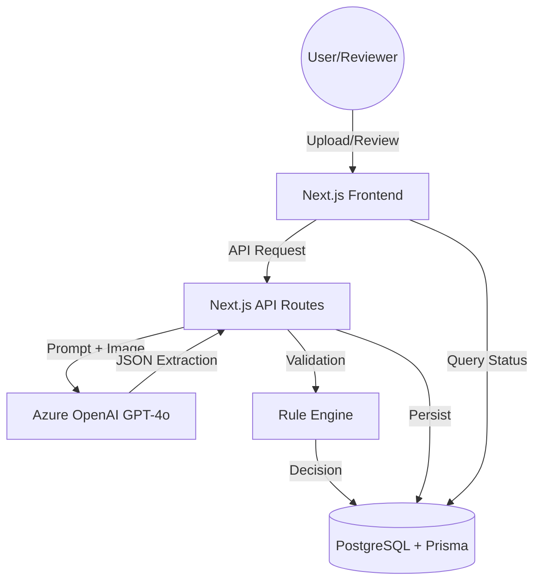

# ARA System: Automated Receipt Approval

ARA (Automated Receipt Approval) is a modern, full-stack solution designed for Contoso to automate operational expense management. It leverages AI-driven data extraction and a deterministic rule engine to process receipts, while maintaining a robust human-in-the-loop workflow for final verification.

## 🏗️ Architecture Overview

The system is built with **Next.js 15+ (App Router)** for its seamless integration of client-side interactivity and secure server-side logic.



### Core Technologies
- **Framework**: Next.js 15 (React 19)
- **Language**: TypeScript
- **Database**: PostgreSQL with Prisma ORM
- **AI**: Azure OpenAI (GPT-4o/o1 models) for Vision-based OCR & Extraction
- **Security**: JWT (jose) with HTTP-only Cookies & bcryptjs for password hashing
- **Styling**: Vanilla CSS + Tailwind CSS 4 for a premium, high-fidelity UI

---

## 🚀 Key Features & Implementation Details

### 1. Intelligent Data Extraction
The system utilizes Azure OpenAI's vision capabilities to extract structured data from receipt images. 
- **Prompt Engineering**: The prompt is designed to return a strict JSON schema including `merchant_name`, `receipt_date` (ISO 8601), `total_amount`, and `category`.
- **Category Matching**: The AI is instructed to map extracted data into one of the 15 valid Contoso categories.
- **Robustness**: The API handles both Chat Completions and the newer Responses API formats, ensuring compatibility with different Azure deployments.

#### Extraction Example
When an image is processed, the AI returns a structured response like this:

```json
{
  "merchant_name": "CLOUD SERVICES SAAS",
  "receipt_date": "2026-01-07",
  "total_amount": 599.00,
  "category": "Software & Subscriptions"
}
```


### 2. Deterministic Rule Engine
The logic resides in `src/lib/ruleEngine.ts` and follows the strict precedence defined in the requirements:
1.  **Rejection (Priority 1)**: Invalid categories, future dates, or dates older than 12 months.
2.  **Automatic Approval (Priority 2)**: Amount < 100 AND not rejected.
3.  **Needs Review (Default)**: Amount ≥ 100 AND not rejected.

### 3. Human-in-the-loop (Reviewer Workflow)
Recognizing that AI is not infallible, the system allows Reviewers to:
- Filter for tickets requiring attention.
- Edit extracted data if the AI made a mistake.
- Override the automated status with a mandatory comment for traceability.
- Once a ticket is finalized, it becomes read-only to preserve the audit trail.

### 4. Security & Compliance
- **Server-Side Execution**: All AI API calls and database interactions happen in Next.js Server Components or API Routes.
- **Authentication**: Role-based access control (RBAC) ensures Employees can only see their own receipts, while Reviewers can see the entire organization's queue.
- **Environment Safety**: Sensitive credentials (Azure Keys, Database URLs) are managed via environment variables.

---

## 🎨 Design Decisions

I prioritized a **Premium User Experience** to ensure high adoption rates:
- **Visual Clarity**: Used a curated color palette (Success Emerald, Warning Amber, Danger Rose) to communicate status instantly.
- **Micro-interactions**: Subtle hover states and transitions provide feedback during the upload and review processes.
- **Responsiveness**: The dashboard is fully responsive, allowing reviewers to approve expenses on the go.

---

## ⚖️ Trade-offs & Limitations

- **OCR Accuracy**: While GPT-4o Vision is state-of-the-art, extremely blurry or handwritten receipts may require human correction. This is why the "Needs Review" and "Edit" features are central to the architecture.
- **Rate Limiting**: The system is tuned for the provided 10,000 TPM limit. I implemented error handling to catch 429 responses and notify the user to retry.
- **Storage**: For this demo, images are stored as Base64 strings in the PostgreSQL database. For a production-scale system, I would move these to a Blob Storage solution (like Azure Blob Storage) and store only the URL.
- **Duplicate Detection**: The current implementation does not check for duplicate receipt uploads (e.g., the same physical ticket uploaded multiple times). For the purpose of this demo, this validation was omitted to focus on the extraction and rule engine logic.

---

## 🛠️ Getting Started

1.  **Environment Setup**: Copy `.env.example` to `.env` and fill in your Azure OpenAI credentials and Database URL.
2.  **Install Dependencies**:
    ```bash
    npm install
    ```
3.  **Database Migration & Seeding**:
    ```bash
    npx prisma migrate dev
    npx prisma db seed
    ```
4.  **Run Development Server**:
    ```bash
    npm run dev
    ```

---

## 👨‍💻 Note for Day-2 Engineers
The codebase is structured to be highly modular. If you need to add a new rule, simply update the `evaluateReceipt` function in `src/lib/ruleEngine.ts`. To add a new category, update `src/lib/constants.ts`. The UI components are located in `src/components`, separating business logic from presentation.
